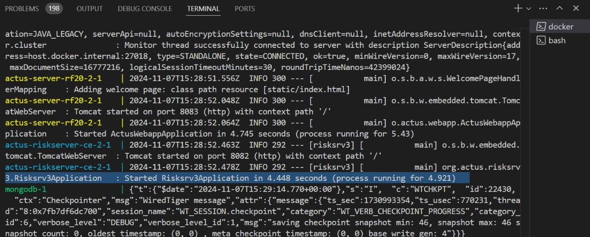

# ACTUS Quick Start

## GitHub Version

This guide provides a step-by-step approach to quickly set up and use the ACTUS framework using Docker.

## Prerequisites

Ensure the following conditions are met before beginning the installation:

- Docker Desktop is installed and running.
- The following ports are free and available:
  - **8083**: ACTUS service
  - **8082**: Risk service
  - **27018**: MongoDB

## Installation

Follow these steps to install and run ACTUS:

1. Clone the repository:
   ```bash
   git clone https://github.com/fnparr/docker-actus-rf20
   ```
2. Navigate to the directory where the repository was cloned.

3. Run the following command to start the Docker containers:

   ```bash
   docker compose -f quickstart-docker-actus-rf20.yml -p quickstart-docker-actus-rf20 up

   ```

4. Verify that the services are running by checking the logs for the following confirmation message:
   ```plaintext
   Risksrv3Application Started Risksrv3Application in X.XXX seconds
   ```



## Populating the Database

Populate the database with sample risk factor definitions for a US Treasury 5-Year Falling scenario.

1. Navigate to the test files directory:
   ```plaintext
   docker-actus-rf20/actus-riskserver-ce/actus-riskservice/testB
   ```
2. Run the command to populate the risk database:
   ```bash
   source putUst5Y_falling.txt
   ```
3. Verify successful execution by checking for this message:
   ```plaintext
   ReferenceIndex added Successfully
   ```
4. Confirm the database population by issuing a curl command:
   ```bash
   curl -v http://localhost:8082/findAllReferenceIndexes
   ```

This will display the reference data that has been created and saved.

## Running a Sample ACTUS Simulation

To execute an ACTUS simulation using the populated data:

1. Run the following command:

   ```bash
   source l3ANNwRF.txt

   ```

2. Upon successful execution, you should see this message:
   ```json
   "status": "Success"
   ```

## Completion

Congratulations! You have successfully:

1. Installed the ACTUS framework.

2. Populated the database with sample risk factors.

3. Run an ACTUS simulation.

Visit the [ACTUS GitHub Repository](https://github.com/fnparr/docker-actus-rf20) periodically for updates and additional resources.
